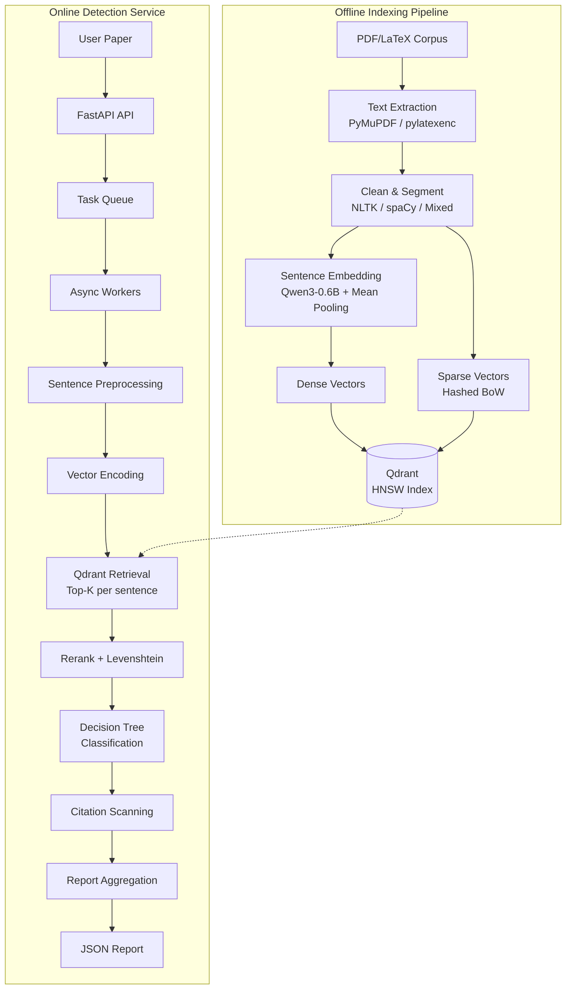

# Copyless Technical Specification

> Authoritative technical reference for the Copyless academic plagiarism detection system.  
> For quick-start guide and usage, see [README.md](README.md).

---

## Table of Contents

1. [Introduction](#1-introduction)
2. [System Architecture](#2-system-architecture)
3. [Data Processing & Indexing Pipeline](#3-data-processing--indexing-pipeline)
4. [Similarity Computation & Classification](#4-similarity-computation--classification)
5. [Citation Detection & Exclusion](#5-citation-detection--exclusion)
6. [Report Generation](#6-report-generation)
7. [Online Service Architecture](#7-online-service-architecture)
8. [Evaluation Framework](#8-evaluation-framework)
9. [Vector Database Design](#9-vector-database-design)

---

## 1. Introduction

### 1.1 Background & Motivation

Traditional plagiarism detection systems based on keyword matching or N-gram fingerprinting fail to catch sophisticated paraphrasing and semantic rephrasing — the most common forms of academic misconduct. Copyless addresses this gap by combining:

- **Dense semantic embeddings** (Qwen3-0.6B) to capture meaning-level similarity
- **Sparse lexical signals** (hashed bag-of-words) to detect surface-level copying
- **Multi-stage fusion** to provide explainable, fine-grained classification

### 1.2 Design Goals

| Goal | Approach |
|------|----------|
| **High recall on paraphrasing** | Sentence-level semantic search via dense vectors |
| **Precision on surface copying** | Normalized Levenshtein distance as secondary filter |
| **Citation awareness** | Reference parsing + context-window scanning |
| **Scalability** | Qdrant vector DB with HNSW indexing, async task architecture |
| **Explainability** | Rule-based decision tree (not black-box scoring) |

### 1.3 Classification Taxonomy

The system classifies each sentence into one of five categories:

| Level | Definition |
|-------|-----------|
| **Identical** | Near-verbatim copy (≤1% character difference) |
| **Minor Changes** | Small word substitutions with preserved structure |
| **Paraphrased** | Semantically equivalent but lexically different |
| **Cited** | Would be Minor Changes/Paraphrased, but properly cited |
| **Original** | No significant match found in the corpus |

---

## 2. System Architecture

### 2.1 High-Level Flow



### 2.2 Module Dependency Map

```
pipeline.py ──→ extract.py ──→ preprocess.py ──→ embedding.py ──→ qdrant_io.py
                                                                      │
service/api.py ──→ service/tasks.py                                   │
       │              │                                                │
       └──→ service/worker.py ──→ service/retrieval.py ───────────────┘
                  │                       │
                  ├──→ service/utils.py   ├──→ service/citations.py
                  └──→ service/report.py  └──→ hybrid_search.py
```

---

## 3. Data Processing & Indexing Pipeline

### 3.1 Text Extraction (`extract.py`)

| Source | Library | Fallback |
|--------|---------|----------|
| PDF | PyMuPDF (`fitz`) | Page-by-page with error isolation |
| LaTeX | `pylatexenc.LatexNodes2Text` | Regex-based command stripping |

All extraction functions include structured error handling with per-file logging. Failed files return `None` and are skipped without halting the pipeline.

### 3.2 Text Preprocessing (`preprocess.py`)

**Cleaning pipeline:**
1. Unicode normalization (NFC)
2. Control character removal
3. Whitespace consolidation
4. Line break standardization

**Sentence segmentation strategies:**

| Strategy | Implementation | Best For |
|----------|---------------|----------|
| `nltk` | NLTK Punkt tokenizer (model cached after first load) | English text |
| `spacy` | spaCy `en_core_web_sm` pipeline | Complex English |
| `mixed` | Heuristic CJK/Latin split + NLTK | Multilingual documents |

### 3.3 Sentence Embedding (`embedding.py`)

**Model:** Qwen3-0.6B (hidden_size = 1024 by default)

**Encoding pipeline:**
1. Tokenize with `AutoTokenizer` (padding, truncation, max_length=1024)
2. Forward pass through `AutoModel` → `last_hidden_state`
3. **Mean pooling** with attention mask (zero-padded positions excluded)
4. L2 normalization → unit vectors for cosine similarity
5. GPU memory cleanup via `torch.cuda.empty_cache()` after each full encoding pass

**Optimizations:**
- FP16 inference on CUDA devices
- `device_map="auto"` for multi-GPU distribution (via `accelerate`)
- Batched encoding with configurable `batch_size`
- Deterministic dummy mode for testing (SHA-1 seeded random vectors)

### 3.4 Vector Indexing

**Dense vectors** → Qdrant collection with HNSW cosine similarity index  
**Sparse vectors** → Hashed bag-of-words (SHA-1 hash, 2²⁰ modulo) with TF scaling

**Payload schema per point:**

| Field | Type | Description |
|-------|------|-------------|
| `text` | string | Original sentence text |
| `path` | string | Source file path |
| `paper_id` | string | arXiv ID (if parseable) |
| `sent_index` | int | Sentence ordinal in document |
| `char_start` | int | Character offset (start) |
| `char_end` | int | Character offset (end) |
| `embedding_model` | string | Model identifier |

**Point ID generation:** SHA-256 hash of `{file_path}:{sentence_index}` (truncated to 32 hex chars, converted to UUID).

---

## 4. Similarity Computation & Classification

### 4.1 Two-Stage Retrieval

**Stage 1 — Semantic Recall:**
- Query: input sentence vector
- Search: Qdrant Top-K nearest neighbors (cosine similarity)
- Returns: candidate set `{(text, paper_id, Sim_cos)}`

**Stage 2 — Lexical Precision:**
- For each candidate: compute normalized Levenshtein similarity

```
Sim_lev = 1 - LevenshteinDistance(S_query, S_candidate) / max(len(S_query), len(S_candidate))
```

Implementation uses `rapidfuzz` C library for O(nm) performance, with pure-Python fallback.

### 4.2 Decision Tree Classification

```python
def classify(sim_cos, sim_lev, has_citation, thresholds):
    if sim_lev >= T_LEV_HIGH (0.99):
        status = "identical"
    elif sim_lev >= T_LEV_MED (0.90) and sim_cos >= T_COS_HIGH (0.95):
        status = "minor_changes"
    elif sim_cos >= T_COS_MID (0.88):
        status = "paraphrased"
    else:
        status = "original"

    if has_citation and status in {"minor_changes", "paraphrased"}:
        status = "cited"

    return status
```

**Design rationale:**
- Decision tree provides **explainability** — each classification maps to a clear rule
- Lexical check first: catches verbatim copying regardless of semantic score
- Semantic check second: catches paraphrasing that lexical metrics miss
- Citation override last: ensures properly cited content isn't penalized

### 4.3 Weighted Fusion Score

For ranking and aggregation purposes:

```
Score_final = w_cos × Sim_cosine + w_lev × Sim_levenshtein
            = 0.7  × Sim_cosine + 0.3  × Sim_levenshtein
```

The 70/30 weighting reflects the priority: semantic similarity (paraphrase detection) is more important than surface similarity.

### 4.4 Candidate Selection

Among Top-K candidates from retrieval, the system selects the **best match** by:
1. Highest `Score_final`
2. Tie-breaking by severity priority: `identical > cited > minor_changes > paraphrased > original`

---

## 5. Citation Detection & Exclusion

### 5.1 Implementation (`citations.py`)

**Step 1: Reference Section Parsing**
- Detect "References" / "Bibliography" section header via regex
- Parse each entry: extract label `[1]`, `[Author et al., 2025]` → map to arXiv IDs
- Regex: `arXiv:\d{4}\.\d{4,5}(v\d+)?`

**Step 2: Inline Citation Localization**
- Scan body text for inline citation markers: `[1]`, `[1, 2, 3]`, `[Author 2025]`
- Map detected labels to paper IDs via reference lookup table

**Step 3: Context Window Scanning**
- For each sentence flagged as `minor_changes` or `paraphrased`:
  - Define window: `[idx - K, idx + K]` sentences (configurable K)
  - Check if any sentence in window contains a citation to the matched source paper

**Step 4: Classification Override**
- If citation to matched source exists in window → reclassify as `cited`

### 5.2 Design Decisions

- **Window-based** rather than same-sentence-only: academic writing often places citations at paragraph boundaries
- **ArXiv ID normalization**: strips version suffixes (`v1`, `v2`) for robust matching
- **Graceful degradation**: if no reference section is found, citation detection returns `false` (conservative)

---

## 6. Report Generation

### 6.1 Document-Level Similarity Score

```
Score = (N_identical × 1.0 + N_minor_changes × 0.8 + N_paraphrased × 0.6) / N_total_sentences
```

**Weight rationale:**
- Identical (1.0): verbatim copying is the most severe
- Minor changes (0.8): near-verbatim with small edits
- Paraphrased (0.6): semantic copying but with significant rewording
- Cited: excluded from penalty calculation (correctly attributed)

### 6.2 Source Contribution Ranking

For each matched source paper, accumulate weighted scores:
- Identical match → +1.0
- Minor changes → +0.8
- Paraphrased → +0.6
- Cited → +0.4 (tracked but lower weight)

Sort by total score, return Top-5 sources with sentence counts and normalized contribution weights.

### 6.3 Report Schema

```json
{
    "overall_similarity_score": 0.235,
    "summary": {
        "total_sentences": 500,
        "identical_count": 20,
        "minor_changes_count": 45,
        "paraphrased_count": 58,
        "cited_count": 12,
        "original_count": 365
    },
    "top_sources": [
        {
            "paper_id": "arXiv:2401.12345",
            "score": 15.2,
            "sentence_count": 18,
            "weight": 1.0
        }
    ],
    "sentence_details": [
        {
            "index": 0,
            "text": "This method achieves state-of-the-art results.",
            "status": "minor_changes",
            "similarity_score": 0.96,
            "semantic_score": 0.97,
            "lexical_score": 0.93,
            "has_citation": false,
            "matched_source": {
                "sentence": "Our approach obtains state-of-the-art performance.",
                "paper_id": "arXiv:2401.12345",
                "similarity_score": 0.97,
                "lexical_score": 0.93
            }
        }
    ]
}
```

---

## 7. Online Service Architecture

### 7.1 API Design (RESTful, Async)

| Endpoint | Method | Description | Response |
|----------|--------|-------------|----------|
| `/v1/papers/check` | POST | Submit paper for detection | 202 Accepted + `task_id` |
| `/v1/reports/{task_id}` | GET | Poll task status & report | 200 OK + status/report |
| `/v1/benchmarks/run` | POST | Submit benchmark evaluation | 202 Accepted + `task_id` |

### 7.2 Task Lifecycle

```
pending → processing → completed / failed
```

- **Task Queue**: In-memory dict + deque with thread-safe locking
- **TTL Cleanup**: Completed/failed tasks auto-purged after 1 hour (prevents memory leak)
- **Public API**: All task mutations via public methods (no private attribute access)

### 7.3 Worker Architecture

- **N async workers** (configurable, default 2) consume tasks from queue
- CPU-intensive work (encoding, retrieval, classification) runs in **thread pool executor** to avoid blocking the asyncio event loop
- **Webhook callbacks**: optional `callback_url` for push notification on completion

### 7.4 Service Lifecycle Management

Uses FastAPI's recommended **`lifespan` context manager** pattern:
- **Startup**: Initialize task queue, spawn worker coroutines
- **Shutdown**: Cancel workers gracefully, await cleanup

---

## 8. Evaluation Framework

### 8.1 Sentence-Level Benchmark

**Input format** (JSONL):
```json
{"id": "s001", "text": "The quick brown fox...", "dupes": ["s042", "s103"]}
```

**Process:**
1. Encode all sentences
2. Find nearest neighbor for each (in-memory or Qdrant)
3. Apply similarity threshold
4. Compare predicted pairs vs. ground-truth pairs

**Metrics:**
- Precision = TP / (TP + FP)
- Recall = TP / (TP + FN)
- F1 = 2 × P × R / (P + R)
- Latency: average, P95, P99 (encoding + retrieval)
- Throughput: sentences/sec, queries/sec

### 8.2 Document-Level Benchmark

**Input format** (JSONL):
```json
{"doc_id": "d001", "path": "/path/to/paper.pdf", "dupes": ["d042"]}
```

**Process:**
1. Extract text, segment sentences, encode all
2. Cross-document sentence matching (threshold-based)
3. Aggregate to document pairs: qualify if `matched_count ≥ K` OR `matched_ratio ≥ R`
4. Compare predicted document pairs vs. ground truth

**Configurable parameters:**
- `sim_threshold` (default 0.8): cosine similarity cutoff
- `doc_min_pairs` (default 3): minimum matching sentences for document-level flag
- `doc_min_ratio` (default 0.05): minimum ratio relative to shorter document

### 8.3 Benchmark Backends

| Backend | Description | Use Case |
|---------|-------------|----------|
| `inmem` | NumPy-based cosine similarity matrix | Fast iteration, small datasets |
| `qdrant` | Full Qdrant search with HNSW | Production-realistic evaluation |

---

## 9. Vector Database Design

### 9.1 Capacity Planning

For an arXiv corpus (~5M papers, ~50M sentences with 1024-dim vectors):

| Resource | Calculation | Recommendation |
|----------|-------------|----------------|
| **Storage per vector** | 1024 × 4 bytes = 4 KB | — |
| **Raw vector storage** | 50M × 4 KB = 200 GB | — |
| **With HNSW overhead** | ~1.5× = 300 GB | NVMe SSD required |
| **RAM (full in-memory)** | 300+ GB | 3-5 node cluster, 128GB/node |
| **RAM (quantized)** | ~75 GB (int8 scalar) | Single high-memory node possible |

### 9.2 HNSW Index Tuning

| Parameter | Recommended | Effect |
|-----------|-------------|--------|
| `M` (max connections) | 16-32 | Higher = better recall, more RAM |
| `ef_construct` | 256-512 | Higher = better index quality, slower build |
| `ef` (search) | 128 | Higher = better recall, higher latency |

### 9.3 Hybrid Collection Schema

```python
vectors_config = {
    "dense": VectorParams(size=1024, distance=Distance.COSINE),
}
sparse_vectors_config = {
    "bow": SparseVectorParams()  # Hashed BoW, ~1M dimensions
}
```

### 9.4 Quantization Trade-offs

| Method | Memory Reduction | Precision Impact | Recommendation |
|--------|-----------------|-----------------|----------------|
| Scalar (int8) | ~75% | Minimal (~1-2% recall drop) | OK for initial deployment |
| Binary | ~97% | Significant | Not recommended for plagiarism detection |
| None | 0% | Maximum precision | Ideal if RAM allows |

---

*Last updated: 2026-03*
