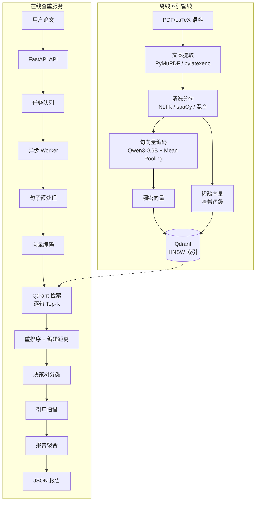

# Copyless 技术设计文档

> Copyless 学术论文查重系统权威技术参考文档。  
> 快速上手指南请参见 [README.md](README.md)。

---

## 目录

1. [项目背景与设计目标](#1-项目背景与设计目标)
2. [系统架构](#2-系统架构)
3. [数据处理与索引管线](#3-数据处理与索引管线)
4. [相似度计算与分类判定](#4-相似度计算与分类判定)
5. [引用检测与排除](#5-引用检测与排除)
6. [报告生成](#6-报告生成)
7. [在线服务架构](#7-在线服务架构)
8. [评测框架](#8-评测框架)
9. [向量数据库设计](#9-向量数据库设计)

---

## 1. 项目背景与设计目标

### 1.1 背景与动机

传统基于关键词匹配或 N-gram 指纹的查重系统无法识别高级改写和语义替换——而这恰恰是学术不端中最常见的手段。Copyless 通过以下三层机制来解决这一问题：

- **稠密语义向量**（Qwen3-0.6B）：捕捉语义层面的相似性
- **稀疏词法信号**（哈希词袋模型）：检测表层文字的直接复制
- **多阶段融合判定**：提供可解释的细粒度分类结果

### 1.2 设计目标

| 目标 | 实现方式 |
|------|----------|
| **改写高召回** | 基于稠密向量的句级语义检索 |
| **表层高精度** | 归一化 Levenshtein 距离作为二次过滤器 |
| **引用感知** | 参考文献解析 + 上下文窗口扫描 |
| **可扩展性** | Qdrant 向量库 + HNSW 索引 + 异步任务架构 |
| **可解释性** | 基于规则的决策树（非黑箱评分） |

### 1.3 分类体系

系统将每个句子分为五个类别：

| 类别 | 定义 |
|------|------|
| **完全相同（Identical）** | 近乎逐字复制（≤1% 字符差异） |
| **微调修改（Minor Changes）** | 少量词语替换，结构保持不变 |
| **改写（Paraphrased）** | 语义等价但词汇表达不同 |
| **已引用（Cited）** | 本应判定为微调/改写，但已正确标注引用 |
| **原创（Original）** | 在语料库中未找到显著匹配 |

---

## 2. 系统架构

### 2.1 整体流程



### 2.2 模块依赖关系

```
pipeline.py ──→ extract.py ──→ preprocess.py ──→ embedding.py ──→ qdrant_io.py
                                                                      │
service/api.py ──→ service/tasks.py                                   │
       │              │                                                │
       └──→ service/worker.py ──→ service/retrieval.py ───────────────┘
                  │                       │
                  ├──→ service/utils.py   ├──→ service/citations.py
                  └──→ service/report.py  └──→ hybrid_search.py
```

---

## 3. 数据处理与索引管线

### 3.1 文本提取（`extract.py`）

| 来源 | 依赖库 | 降级方案 |
|------|--------|----------|
| PDF | PyMuPDF（`fitz`） | 逐页提取，单页失败不中断 |
| LaTeX | `pylatexenc.LatexNodes2Text` | 正则表达式剥离 LaTeX 命令 |

所有提取函数均包含结构化异常处理和逐文件日志记录。失败文件返回 `None`，不会中断整条管线。

### 3.2 文本预处理（`preprocess.py`）

**清洗管线：**
1. Unicode 归一化（NFC）
2. 控制字符移除
3. 空白字符合并
4. 换行符标准化

**分句策略：**

| 策略 | 实现方式 | 适用场景 |
|------|----------|----------|
| `nltk` | NLTK Punkt 分句器（首次加载后缓存模型） | 英文文本 |
| `spacy` | spaCy `en_core_web_sm` 管线 | 复杂英文 |
| `mixed` | 启发式中英文分离 + NLTK | 多语言文档 |

### 3.3 句向量编码（`embedding.py`）

**模型：** Qwen3-0.6B（hidden_size = 1024）

**编码流程：**
1. `AutoTokenizer` 分词（padding、truncation、max_length=1024）
2. `AutoModel` 前向传播 → `last_hidden_state`
3. **Mean Pooling**（基于 attention mask 排除 padding 位置）
4. L2 归一化 → 单位向量（便于余弦相似度计算）
5. GPU 显存清理：每轮编码完成后调用 `torch.cuda.empty_cache()`

**优化措施：**
- CUDA 设备上 FP16 半精度推理
- `device_map="auto"` 支持多 GPU 分布式推理（通过 `accelerate`）
- 可配置 `batch_size` 的批量编码
- 确定性 dummy 模式用于测试（SHA-1 种子随机向量）

### 3.4 向量索引

**稠密向量** → Qdrant 集合，HNSW 余弦相似度索引  
**稀疏向量** → 哈希词袋模型（SHA-1 哈希，2²⁰ 取模），TF 权重

**每个向量点的 Payload 字段：**

| 字段 | 类型 | 说明 |
|------|------|------|
| `text` | string | 原始句子文本 |
| `path` | string | 来源文件路径 |
| `paper_id` | string | arXiv ID（如可解析） |
| `sent_index` | int | 句子在文档中的序号 |
| `char_start` | int | 字符偏移量（起始） |
| `char_end` | int | 字符偏移量（结束） |
| `embedding_model` | string | 模型标识 |

**向量点 ID 生成：** `{file_path}:{sentence_index}` 的 SHA-256 哈希值（截取前 32 个十六进制字符，转为 UUID）。

---

## 4. 相似度计算与分类判定

### 4.1 两阶段检索

**第一阶段 — 语义召回：**
- 查询：输入句子的向量表示
- 检索：Qdrant Top-K 最近邻（余弦相似度）
- 返回：候选集 `{(text, paper_id, Sim_cos)}`

**第二阶段 — 词法精筛：**
- 对每个候选项计算归一化 Levenshtein 相似度

```
Sim_lev = 1 - LevenshteinDistance(S_query, S_candidate) / max(len(S_query), len(S_candidate))
```

实现使用 `rapidfuzz` C 库（O(nm) 性能），并提供纯 Python 后备实现。

### 4.2 决策树分类

```python
def classify(sim_cos, sim_lev, has_citation, thresholds):
    if sim_lev >= T_LEV_HIGH (0.99):
        status = "identical"       # 完全相同
    elif sim_lev >= T_LEV_MED (0.90) and sim_cos >= T_COS_HIGH (0.95):
        status = "minor_changes"   # 微调修改
    elif sim_cos >= T_COS_MID (0.88):
        status = "paraphrased"     # 改写
    else:
        status = "original"        # 原创

    # 引用覆盖
    if has_citation and status in {"minor_changes", "paraphrased"}:
        status = "cited"           # 已引用

    return status
```

**设计理由：**
- 决策树提供**可解释性** — 每种分类对应明确的规则条件
- 词法检查优先：无论语义得分如何，直接捕获逐字复制
- 语义检查其次：捕获词法指标无法发现的改写行为
- 引用覆盖最后：确保正确标注引用的内容不被误判

### 4.3 加权融合评分

用于排名和汇总：

```
Score_final = w_cos × Sim_cosine + w_lev × Sim_levenshtein
            = 0.7  × Sim_cosine + 0.3  × Sim_levenshtein
```

70/30 的权重反映了优先级：语义相似度（改写检测）比表层相似度更重要。

### 4.4 候选项选择

在 Top-K 候选项中，系统按以下规则选出**最佳匹配**：
1. 最高 `Score_final`
2. 平分时按严重程度优先级排序：`identical > cited > minor_changes > paraphrased > original`

---

## 5. 引用检测与排除

### 5.1 实现（`citations.py`）

**步骤 1：参考文献章节解析**
- 通过正则表达式检测 "References" / "Bibliography" 章节标题
- 解析每条文献：提取标签 `[1]`、`[Author et al., 2025]` → 映射到 arXiv ID
- 正则：`arXiv:\d{4}\.\d{4,5}(v\d+)?`

**步骤 2：行内引用定位**
- 扫描正文中的引用标记：`[1]`、`[1, 2, 3]`、`[Author 2025]`
- 通过参考文献查找表将标签映射到论文 ID

**步骤 3：上下文窗口扫描**
- 对每个被标记为 `minor_changes` 或 `paraphrased` 的句子：
  - 定义窗口：`[idx - K, idx + K]` 个句子（K 可配置）
  - 检查窗口内是否有句子包含对匹配来源论文的引用

**步骤 4：分类覆盖**
- 若窗口内存在对匹配来源的引用 → 重分类为 `cited`

### 5.2 设计决策

- **基于窗口**而非仅限同句：学术写作中引用常出现在段落边界处
- **ArXiv ID 归一化**：去除版本后缀（`v1`、`v2`）以保证鲁棒匹配
- **优雅降级**：未发现参考文献章节时，引用检测返回 `false`（保守策略）

---

## 6. 报告生成

### 6.1 文档级相似度评分

```
Score = (N_identical × 1.0 + N_minor_changes × 0.8 + N_paraphrased × 0.6) / N_total_sentences
```

**权重理由：**
- 完全相同（1.0）：逐字复制，严重程度最高
- 微调修改（0.8）：近乎逐字，仅少量编辑
- 改写（0.6）：语义复制但有较大程度的措辞调整
- 已引用：排除在惩罚计算之外（已正确标注来源）

### 6.2 来源贡献排名

对每个匹配来源论文，累加加权得分：
- 完全相同匹配 → +1.0
- 微调修改 → +0.8
- 改写 → +0.6
- 已引用 → +0.4（记录但权重较低）

按总分排序，返回 Top-5 来源及其匹配句数和归一化贡献权重。

### 6.3 报告结构

```json
{
    "overall_similarity_score": 0.235,
    "summary": {
        "total_sentences": 500,
        "identical_count": 20,
        "minor_changes_count": 45,
        "paraphrased_count": 58,
        "cited_count": 12,
        "original_count": 365
    },
    "top_sources": [
        {
            "paper_id": "arXiv:2401.12345",
            "score": 15.2,
            "sentence_count": 18,
            "weight": 1.0
        }
    ],
    "sentence_details": [
        {
            "index": 0,
            "text": "This method achieves state-of-the-art results.",
            "status": "minor_changes",
            "similarity_score": 0.96,
            "semantic_score": 0.97,
            "lexical_score": 0.93,
            "has_citation": false,
            "matched_source": {
                "sentence": "Our approach obtains state-of-the-art performance.",
                "paper_id": "arXiv:2401.12345",
                "similarity_score": 0.97,
                "lexical_score": 0.93
            }
        }
    ]
}
```

---

## 7. 在线服务架构

### 7.1 API 设计（RESTful，异步）

| 接口 | 方法 | 说明 | 响应 |
|------|------|------|------|
| `/v1/papers/check` | POST | 提交论文进行查重 | 202 Accepted + `task_id` |
| `/v1/reports/{task_id}` | GET | 轮询任务状态和报告 | 200 OK + 状态/报告 |
| `/v1/benchmarks/run` | POST | 提交评测任务 | 202 Accepted + `task_id` |

### 7.2 任务生命周期

```
pending（等待中）→ processing（处理中）→ completed（完成）/ failed（失败）
```

- **任务队列**：内存 dict + deque，线程安全锁保护
- **TTL 清理**：已完成/失败任务 1 小时后自动清除（防止内存泄漏）
- **公共接口**：所有任务变更均通过公共方法进行（不直接访问私有属性）

### 7.3 Worker 架构

- **N 个异步 Worker**（可配置，默认 2 个）从队列消费任务
- CPU 密集型工作（编码、检索、分类）在**线程池执行器**中运行，避免阻塞 asyncio 事件循环
- **Webhook 回调**：可选 `callback_url`，任务完成后推送通知

### 7.4 服务生命周期管理

采用 FastAPI 推荐的 **`lifespan` 上下文管理器**模式：
- **启动**：初始化任务队列，启动 Worker 协程
- **关闭**：优雅取消 Worker，等待清理完成

---

## 8. 评测框架

### 8.1 句级评测

**输入格式**（JSONL）：
```json
{"id": "s001", "text": "The quick brown fox...", "dupes": ["s042", "s103"]}
```

**流程：**
1. 编码所有句子
2. 为每个句子找最近邻（内存模式或 Qdrant）
3. 应用相似度阈值
4. 将预测对与标注对比较

**指标：**
- Precision = TP / (TP + FP)
- Recall = TP / (TP + FN)
- F1 = 2 × P × R / (P + R)
- 延迟：平均、P95、P99（编码 + 检索）
- 吞吐量：sentences/sec，queries/sec

### 8.2 文档级评测

**输入格式**（JSONL）：
```json
{"doc_id": "d001", "path": "/path/to/paper.pdf", "dupes": ["d042"]}
```

**流程：**
1. 提取文本 → 分句 → 编码全部句子
2. 跨文档句子匹配（基于阈值）
3. 聚合为文档对：满足 `matched_count ≥ K` 或 `matched_ratio ≥ R` 则标记
4. 将预测文档对与标注对比较

**可配置参数：**
- `sim_threshold`（默认 0.8）：余弦相似度截断值
- `doc_min_pairs`（默认 3）：文档级标记所需的最少匹配句数
- `doc_min_ratio`（默认 0.05）：相对于较短文档的最低匹配比例

### 8.3 评测后端

| 后端 | 说明 | 使用场景 |
|------|------|----------|
| `inmem` | 基于 NumPy 的余弦相似度矩阵 | 快速迭代，小数据集 |
| `qdrant` | 完整 Qdrant HNSW 检索 | 生产环境仿真评估 |

---

## 9. 向量数据库设计

### 9.1 容量规划

以 arXiv 语料（约 500 万篇论文，约 5000 万句子，1024 维向量）为例：

| 资源 | 计算 | 建议 |
|------|------|------|
| **每向量存储** | 1024 × 4 bytes = 4 KB | — |
| **原始向量存储** | 5000 万 × 4 KB = 200 GB | — |
| **含 HNSW 开销** | ~1.5× = 300 GB | 需 NVMe SSD |
| **内存（全量加载）** | 300+ GB | 3-5 节点集群，128GB/节点 |
| **内存（量化后）** | ~75 GB（int8 标量量化） | 单节点大内存可支撑 |

### 9.2 HNSW 索引调优

| 参数 | 推荐值 | 影响 |
|------|--------|------|
| `M`（最大连接数） | 16-32 | 越大召回越好，但内存开销越大 |
| `ef_construct` | 256-512 | 越大索引质量越高，构建越慢 |
| `ef`（检索时） | 128 | 越大召回越好，延迟越高 |

### 9.3 混合集合 Schema

```python
vectors_config = {
    "dense": VectorParams(size=1024, distance=Distance.COSINE),
}
sparse_vectors_config = {
    "bow": SparseVectorParams()  # 哈希词袋，约 100 万维度
}
```

### 9.4 量化方案权衡

| 方法 | 内存缩减 | 精度影响 | 建议 |
|------|----------|----------|------|
| 标量量化（int8） | ~75% | 极小（召回下降约 1-2%） | 初始部署可用 |
| 二值量化 | ~97% | 显著 | 不推荐用于查重场景 |
| 不量化 | 0% | 最高精度 | 内存充足时首选 |

---

*最后更新：2026-03*
